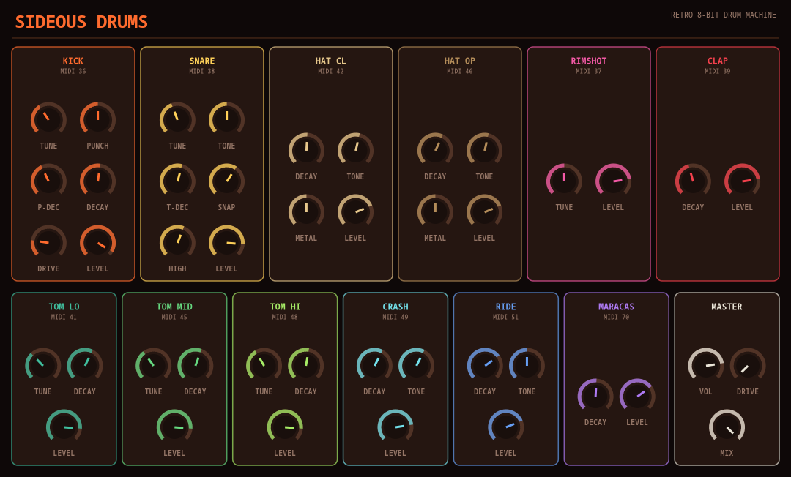

# Sideous Drums


> **⚠️ VIBE CODED SLOP.** This entire plugin — DSP, GUI, CI — was built through
> conversational back-and-forth with an AI, not hand-engineered from a spec.
> It works, it's been tested, but go in with appropriate expectations.

A retro 8-bit-vibe drum synth plugin (VST3 / LV2 / CLAP / JACK standalone),
built on [DPF](https://github.com/DISTRHO/DPF) with a hand-drawn Cairo-based
UI — a companion to [Sideous](https://github.com/marcin-koziol/Sideous-synth),
same visual family, warmer drum-machine-chassis palette. RD-9-style layout:
one column per drum, each with its own knobs and accent color. Each column's
header (name + MIDI note) is itself a trigger pad — click it to play that
voice at full velocity, no MIDI keyboard/host transport needed to audition a
sound while dialing it in.



## Kit

Fixed 12-voice kit, each voice independently tunable, fixed GM-ish MIDI note
map (kick=36, snare=38, closed hat=42, open hat=46, low/mid/high tom=41/45/48,
crash=49, ride=51, rimshot=37, clap=39, maracas=70):

- **Kick** — sine osc with its own pitch envelope (Punch Depth/Decay, the
  classic "pitch sweep" trick), amp decay, drive/saturation for punch
- **Snare** — pitch-enveloped tone layer + independently-decaying highpassed
  noise layer, with a Bright knob so the noise layer can open up into real
  top-end instead of staying capped in a dull mid-range peak
- **Hi-hat closed/open, Crash, Ride** — share a 6-oscillator metallic FM stack
  (classic 808/909 trick) blendable against plain filtered noise via Metal
  (1 = full buzz, 0 = the simpler "chip" alternative), plus a Tune knob that
  transposes the whole partial set (and Ride's Bell) by up to an octave
  either way — the same trick real analog cymbal "tune" pots use, since Tone
  only sweeps the highpass and doesn't retune anything. Closed/open hats form
  a choke group (a closed-hat hit always cuts a still-ringing open hat).
  Crash and Ride are no longer the same voice in different clothes: Ride runs
  a tighter, more harmonic partial cluster (vs. Crash/hats' wide inharmonic
  spread) for a more "pitched" wash, defaults to a higher Metal setting for
  more definition, and adds a Bell knob — a dedicated sine "ping" layer with
  its own (longer) envelope that rings independently of the noisy wash, the
  classic ride-bell character
- **Toms** (low/mid/high) — same engine as the kick, different pitch ranges,
  with a fixed (non-exposed) pitch envelope baked in for character
- **Rimshot** — short sine tock + short filtered noise tick, both fixed-decay
- **Clap** — retriggered noise bursts ("flams") through a bandpass into one
  longer body pulse, the classic 808/909 handclap trick. Tone sweeps the
  bandpass center; Hands (1-7) sets how many pulses make up one hit — 1 is a
  single clean hit with no flam at all, higher counts spread it into more of
  a "crowd" clap (was a fixed 3 flams + 1 body, no user control at all)
- **Maracas** — a cluster of fast retriggered noise grains (the same
  flam-retrigger trick as Clap, just faster/denser) through a resonant
  bandpass instead of a plain highpass; Rattle (0..1) sets how many grains
  fire per hit — 0 is the old single-burst behavior, higher gives a real
  shaken-shaker texture instead of reading as "just another hi-hat"
- **Master** — Volume, plus a Drive/Mix saturation stage as a character/grit
  control, not just a safety limiter

## Note names in the host piano roll

The fixed note map above is reported to the host as actual names ("Kick",
"Snare", ...) instead of raw numbers, wherever the format/host supports it:

- **LV2** — implements Ardour's MIDNAM extension, so Ardour shows note names
  automatically the moment the plugin is loaded on a track, no setup needed.
- **VST3** — implements the standard per-pitch program names interface
  (`IUnitInfo`), read by hosts that support it (e.g. Reaper, Cubase).
- **Any host/format** — [`midnam/Sideous_Drums.midnam`](midnam/Sideous_Drums.midnam)
  is a static MIDNAM file you can install into Ardour's patch-file library and
  assign to a track by hand (right-click the piano-roll header) if you're
  using the VST3/CLAP build there instead of LV2.

(The LV2/VST3 support required a small patch on top of the vendored `dpf/`
submodule — see [`patches/README.md`](patches/README.md); it's applied
automatically by CMake.)

## Presets

A small file-based preset library, entirely UI-side so it works identically
across every host/format including the JACK standalone (which has no host
preset browser of its own): `<` / `>` step through presets, click the name
field to rename, `SAVE`/`DELETE` manage the library. Presets are plain-text
`.sdpreset` files (one `symbol=value` line per parameter) in
`~/.local/share/sideous-drums/presets` (Linux/XDG), `~/Library/Application
Support/sideous-drums/presets` (macOS), or `%APPDATA%\sideous-drums\presets`
(Windows).

Ten factory presets (Classic 808, 909 Techno, Trap Snap, Dub Wobble Toms,
Bright Pop Kit, Lo-Fi Chip, Metal Overload, Soft Brushes, Industrial Noise,
Deep Sub Growl) are seeded into that folder the first time the UI runs with
an empty library — from then on they're just ordinary presets, editable and
deletable like anything you save yourself.

## Two builds

- **Sideous Drums** — a single stereo output, the whole kit summed together.
- **Sideous Drums Multi** — 13 stereo busses (Main mix + one dedicated bus
  per voice), so e.g. the handclap can get its own reverb send in the host
  mixer instead of only ever reaching the summed Main bus. Same engine, same
  UI, identical sound on the Main bus — just more routing options.

## Building

```sh
git clone --recursive <repo-url>
cd sideous-drums
cmake -S . -B build
cmake --build build -j$(nproc)
```

(If you already cloned without `--recursive`, run
`git submodule update --init --recursive` first.)

Built plugins land in `build/bin/`:
- `sideous-drums.vst3` / `.lv2` / `.clap` / `sideous-drums` (JACK/native
  standalone) — stereo build
- `sideous-drums-multi.vst3` / `.lv2` / `.clap` / `sideous-drums-multi` —
  multi-out build

CI ([`.github/workflows/build.yml`](.github/workflows/build.yml)) builds
Linux, Windows, and macOS (universal) packages on every push and attaches
them to GitHub Releases for tagged versions.
